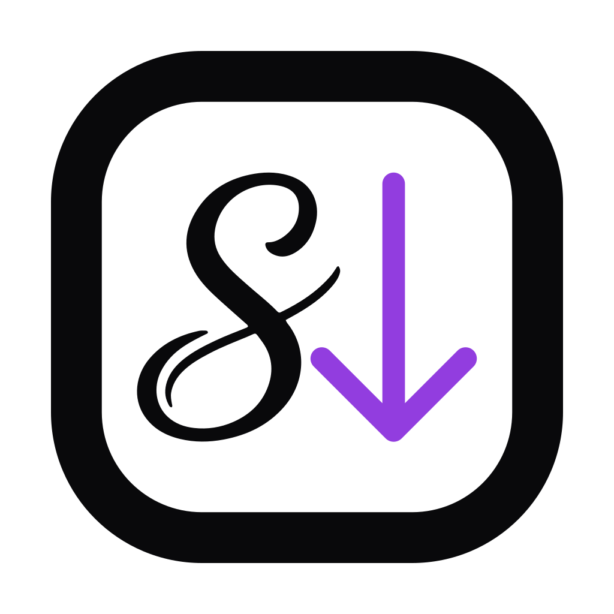

<h1 align="center">Skriver</h1>

Stop reformatting by hand. Write Markdown, get pre-formatted text for your tools.

Write your message once in Markdown, then copy it pre-formatted for the client you're pasting into. Each target client gets its own paste format, so headings, lists, code blocks, and quotes survive the trip intact.

## Supported clients

- Slack
- Microsoft Teams
- Jira
- Notion

## Also included

### Clipboard debugger

A built-in debugger lets you inspect what a client actually puts on the clipboard when you copy from it. Paste into it to see every its content — handy when reverse-engineering a new target.
